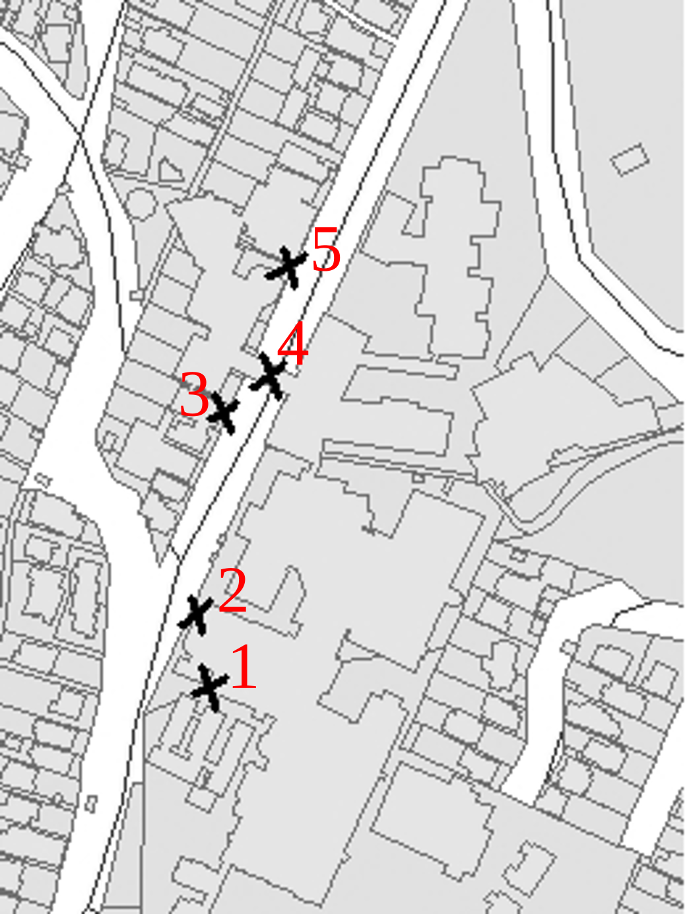
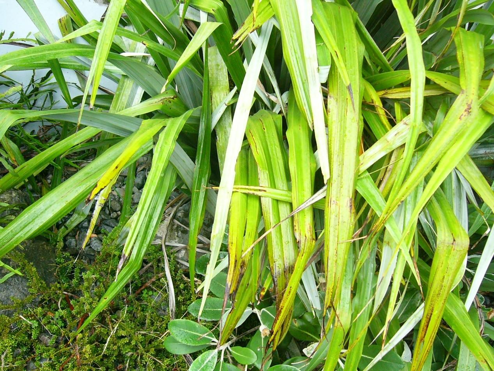

## Geog 315 Lab 1 GPS and data capture
For a printable version of these instructions go [here](lab-01-geog-318-2019.pdf).

There are three parts to this practical all based on (very local) field work. In teams of three or four (preferably your group project groups) you will
+ [locate certain objects based on a map print out](#locate-objects-from-a-map) (and record their coordinates to see how close they are when you map them in the GPS),
+ [record the location of particular entities using a GPS](#recording-objects-using-gps), and
+ [use a GPS to record the location of particular objects](#using-gps-to-locate-objects).

At the end of this assignment you should be familiar with how to use a GPS to record and find the location of objects and be aware of the possible problems with recording and using coordinates.

Some of the results recorded in this practical will be used in future practicals&mdash;so be as accurate as you can.

**In case of problems**, my office is Cotton 227, phone 04 463 6492. I will be there for the duration of the exercise, and Andy will be on the ground to lend a hand.

### How to use your GPS
The GPS unit will allow you to enter coordinates (so you can find them) and mark a location or waypoint (to add to the GPS). The buttons are fairly straightforward and generally resemble those in the image below.

**Source**: [slideplayer.com](http://slideplayer.com/slide/767334/)

### Locate objects from a map
On the map below is a series of handwritten numbers and 'X's, each corresponding to a real world object in the vicinity of the university. There are a number of problems with this map, but when surveyors are collecting data, they may not be given a great map with correct labelling. This makes it harder for the surveyor to collect appropriate data.

In [Table 1](#table-1) on the last page, record in the appropriate field what you think the object is and its coordinates.

### Recording objects using GPS
In this section, you will be marking the coordinates for telephone poles running down Kelburn Parade from the roundabout.

First record the name of your GPS unit (there’s a bunch of letters marked on the back). You will need to remember the name of your GPS for the next lab.

Next, record the coordinates for the five telephone poles running up Kelburn Parade in [Table 2](#table-2) on the last page. Start with the pole just opposite Gate 7 in to the University and turn left up the street to record the remaining four. Remember to name (or record the number) of the waypoints you mark.

### Using GPS to locate objects
Next you need to find five containers hidden at specific coordinates. The first four containers are at the following coordinates and the fifth container can be found by piecing the numbers hidden in the first four containers together in the
following order

Container | Codes
-- | --
1 | A and B
2 | C and D
3 | E and F
4 | G and H

Using this information, you can determine the final container at

&nbsp;&nbsp;&nbsp;&nbsp;S 41&deg;1G.ABC E174&deg;4H.DEF

There is a small prize in the fifth container for the first group to find it!

#### Important&mdash;read carefully!
The containers are small Tupperware tab-lock boxes (about the size of a fist) and are quite difficult to find. To help there are 4 different images which correspond to the specific location of each of the containers. The images are not in order (that would be too easy!). They also might be a little out of date by now.

You do NOT have to go anywhere dangerous to get these. The boxes are located just off tracks. You do NOT have to leave the tracks. Where a track has a steep drop off, the box is NOT located on the steep drop off side!

It might be best to plot these on Google Earth or in ArcGIS first before you go on your hunt.

For the final box, you're on your own, no further clues!

### Finally...
Make sure you have the number of your GPS! You will need it for the next lab.

#### Assessment: 5 points on completion of this assignment. Record your names below.

#### Table 1 (the objects)
Number | Object | Latitude | Longitude
-- | -- | -- | --
1 | | |
2 | | |
3 | | |
4 | | |
5 | | |

#### Table 2 (the telegraph poles)
**GPS Unit name**:

Number | Object | Latitude | Longitude
-- | -- | -- | --
1 | | |
2 | | |
3 | | |
4 | | |
5 | | |
