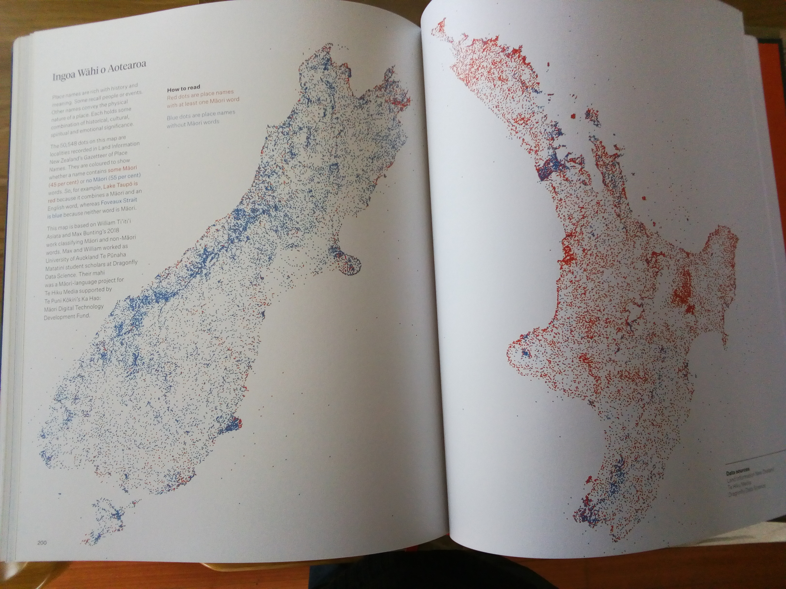

# Aotearoa placename origins
These data were sourced from the locations referenced at [this page](https://github.com/fogonwater/we-are-here/tree/master/8_heart_memory#801-ingoa-w%C4%81hi-o-aotearoa--place-names-of-new-zealand) describing how one of the maps in Chris McDowall and Tim Denee's [_We Are Here_](https://www.masseypress.ac.nz/books/we-are-here/) was produced, specifically this one:

A very similar map is [shown here](https://github.com/TeHikuMedia/nga-kupu) (scroll down for the map).

## Data
+ [Placenames of New Zealand](placenames.gpkg?raw=true)

The key columns in the data table are:

+ `reo` the number of elements in the placename considered likely to be te reo
+ `maybe` the number of elements in the placename consider possibly to be te reo
+ `other` the number of elements in the placename considered not likely to be te reo

These results were assigned using the code available from [this repository](https://github.com/TeHikuMedia/nga-kupu).

## Commentary
The contrast between the prevalence of Māori placenames in Te Ika-a-Māui and Te Waipounamu is immediately apparent in the visualisations linked above. As a first step you should make sure you can replicate these maps. Figure out how to do it for yourself, rather than just grabbing code from the sources linked!

You may have some ideas about more interesting ways to visualise the data. You might consider density maps, or hexbin maps (for this you will probably start from the `st_make_grid` function). Or you might look at additional categories ('mixed' names with some te reo and some other elements for example).

Another direction would be to explore how (if at all) the relative prevalence of names is related to present day population distributions, using more general data available [here](../aotearoa-new-zealand-census-data.md).
