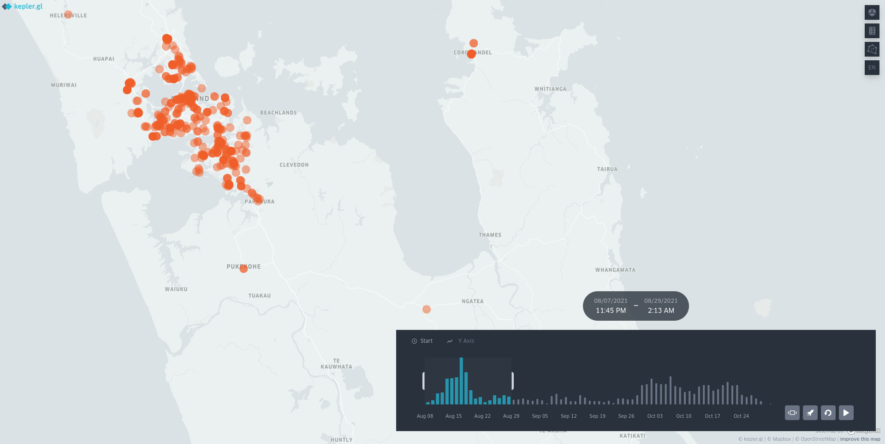

# The 2021 Delta outbreak locations of interest
Here's [another dataset](loi.geojson?raw=true) (right-click **Save As...** to download) pertaining to Aotearoa's SARS Covid-19 pandemic experience. This one is the Ministry of Healths's locations of interest as collated by me from August to October 2021, the 'delta outbreak' that led to the extended Auckland lockdown, and eventually the end of New Zealand being 'COVID-free'. 

The official published list was always 'current'. This list, was assembled over time so that early locations were not dropped when they were no longer of interest.

Here is a [dynamic map of the outbreak](https://southosullivan.com/misc/loi.html) (screenshot below) that I was able to make with these data.

These data might allow you to look at how the outbreak developed over time. Or perhaps you could investigate the degree to which the outbreak was concentrated in particular neighbourhoods, with particular socioeconomic or demographic characteristics (rich/poor, old/young etc.) 

To consider those aspects you will need to use general socioceconomic data available [linked from this page](../aotearoa-new-zealand-census-data.html).

If you are interested in geographies of the COVID pandemic, there are other possible projects [here](../us-covid19/) and [here](../vaccination/).

