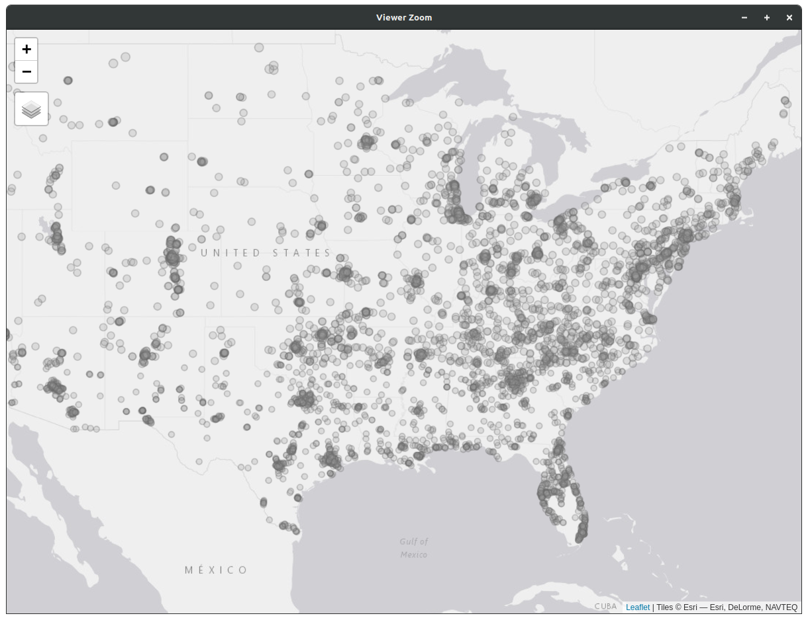

# US Fatal police shootings 2015-23
These data were obtained from these [_Washington Post_](https://www.washingtonpost.com/graphics/investigations/police-shootings-database/) and [_Guardian_](https://www.theguardian.com/us-news/ng-interactive/2015/jun/01/the-counted-police-killings-us-database) projects to record (to the extent possible) all police-involved fatal shootings in the United States from 2015 onwards. Specifically the data were downloaded from [this site](https://github.com/washingtonpost/data-police-shootings) in early September this year (so the most recent data are incomplete).

## Data
Here's [the dataset](us-police-shootings-2015-23.gpkg?raw=true). There are more shootings in the original dataset (at the above link) but these are the 7754 that have been geocoded (i.e. placed on a map).

Information about what the various attributes of the data mean can be found at the above web pages.

## Commentary
### The data
These data have been tidied up a little (specifically, I made them mappable so you would not have to) but might need some further processing depending on what you think of doing with them. That will involve some work in _R_ (or some other program) to clean the data up for further analysis. You may find the `stringr` package particularly useful for this.

### Explorations
The most obvious dimension to explore in relation to police shootings in the United States is with respect to the race of victims. Although there are a lot of shootings in these data (over 7700) that doesn't necessarily mean there are very many shootings in any one area (the US is a big place...), and that also means that drawing conclusions about the relative risks to different population groups is tricky. But this is a dimension that could certainly lead in interesting directions.

To explore the data with respect to general population patterns, you will need more general demographic and other data available [here](../us-census-data.md)
