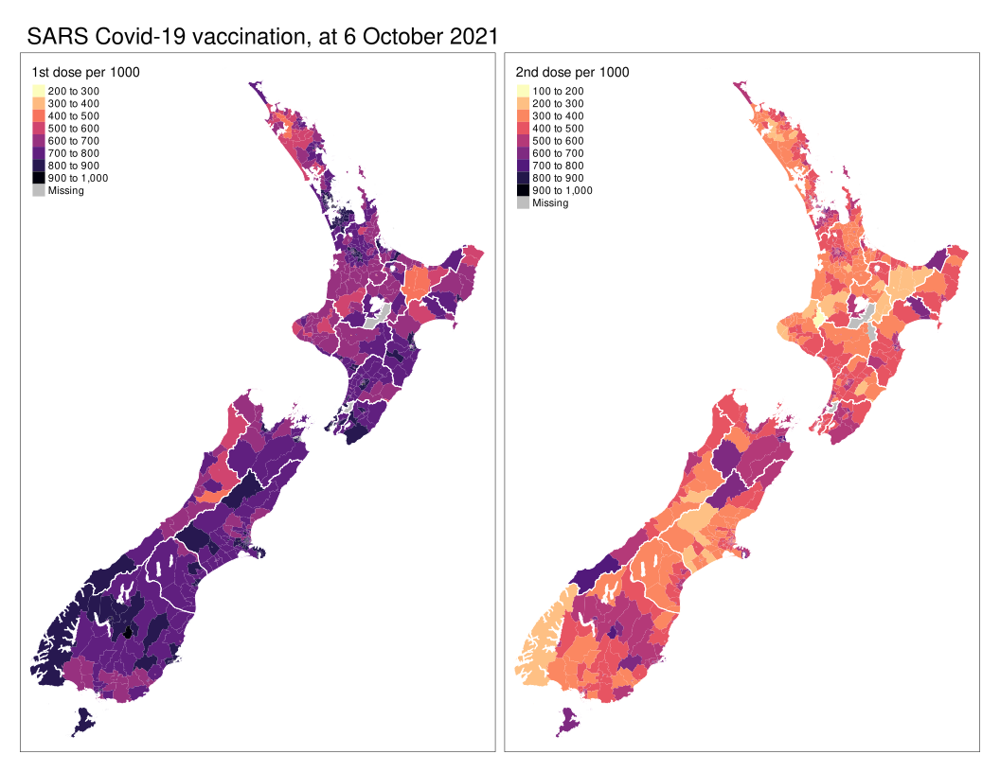

# Aotearoa New Zealand SARS Covid-19 vaccination rollout
Back in October 2021, as the [Auckland August delta outbreak](../delta/README) wore down the elimination strategy, the pandemic response switched to vaccination, which until that point had been pretty slow to get going.

[These data](vax-sa2-20211006.gpkg?raw=true) are from that period, with vaccination rates as reported by the Ministry of Health up to 6 October 2021, down to the Statistical Area 2 (SA2) level. They include information on both first and second doses, and the eligible population counts (at this time eligibility was limited to those aged 12 and above).

Even a cursory mapping of the data makes clear there were significant regional disparities in the vaccination rates:

and that's really what this project is most likely to be about. 

You'll likely want to use additional demographic data, which you'll find [here](../aotearoa-new-zealand-census-data.md).

You may also be interested in other snapshots of the progress of the vaccine rollout. There are numerous datasets, including details of the vaccination rates in different sub-populations and age groups available at the Ministry of Health github account particularly in [this subfolder](https://github.com/minhealthnz/nz-covid-data/tree/main/vaccine-data/sa2-data) where you'll find the SA2 level information.