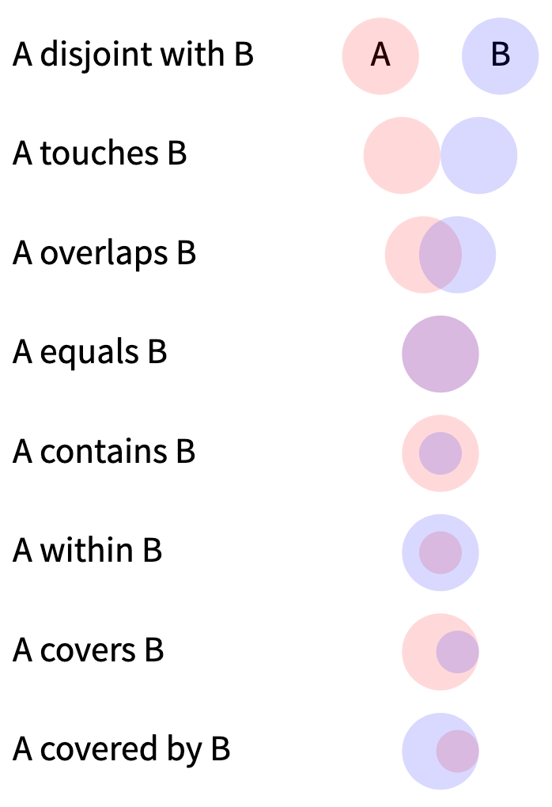

# Spatial data wrangling in `sf`

```{r message = FALSE}
library(sf)
library(tmap)
library(dplyr)
library(magrittr)
library(tidyr)
map_mode <- "view"
tmap_mode(map_mode)
```

The `sf` package supports a wide range of spatial operations both on individual layers, and between layers. These are discussed in this document, for your reference, and may be particularly useful when it comes to the mini-project later in the semester.

I have split operations into those which are performed between two datasets, and those which transform an existing dataset by some geometric method.

I will use three small datasets to demonstrate the various operations. These are loaded as follows:

```{r}
crashes <- st_read("points.gpkg")
streets <- st_read("lines.gpkg")
mblocks <- st_read("polys.gpkg")
```

And make a map to see what we are dealing with

```{r}
tm_shape(mblocks) +
  tm_polygons(col = "pop2013", alpha = 0.5) +
  tm_shape(streets) +
  tm_lines(col = 'purple') +
  tm_shape(crashes) +
  tm_dots()
```

These data are:

- mblocks 2013 Census meshblocks with the population count
- streets street and path network segments
- crashes road crash locations in 2017

All for an area around 1.6km from Te Herenga Waka - Victoria University.

# Operations between layers
The spatial operation most closely related to data table operations is a spatial join. This operation depends on the spatial relations between two layers, which are called binary (spatial) predicates. So we need to look at the predicates before considering join operations.

## Binary predicates

The binary predicates determine whether or not various spatial conditions are met between two datasets. The binary predicates available in `sf` are listed here. These vary in their exact interpretation depending on whether the layers involved are points or lines or polygons, but an illustration of them for polygons is shown below, to give you the idea.



These are as discussed in the paper

Egenhofer MJ & Franzosa RD 1991 [Point-set topological spatial relations](https://dx.doi.org/10.1080/02693799108927841) *International Journal of Geographical Information Systems* **5**(2) 161-174.

This [wikipedia article](https://en.wikipedia.org/wiki/DE-9IM) provides a good overview of the underlying concepts.

The various binary spatial predicate functions in sf return for two datasets which geometries in the first dataset are related to which in the second based on the relation specified. For example, if we want to know which points in the crashes dataset are in which meshblocks, we would do

```{r}
crashes %>% 
  st_within(mblocks)
```

The list output is which of the polygons in the `mblocks` dataset the first 10 of the points in the `crashes` data layer is within. If we do the equivalent test in reverse

```{r}
mblocks %>% 
  st_contains(crashes)
```

we get which points are contained by each of the polygons. In this case the first four polygons in `mblocks` contain no points from `crashes`, the next one contains crash 326, the next one contains several crashes, and so on.

The results we see here show only the first few rows of the results. They are also in a ‘sparse’ format showing only the relations which are `TRUE`. If we request the complete results by setting the option `sparse` to `FALSE` then we see a matrix which shows for every combination of object in the first dataset (the rows) which objects in the second dataset (the columns) satisfies the required spatial relationship.

```{r}
st_contains(mblocks, crashes, sparse = FALSE)[1:10, 1:10]
```

Usually the sparse form (the default) is less of a pain to deal with! In that form, the result is a list and extracting the information it contains requires some additional processing.

As an example, we can use the `st_contains()` operation to count points in polygons. For example, perhaps we want to count the number of crashes in different areas, then the `lengths()` function applied to the result of `st_contains()` gives us that information.

```{r}
num_crashes <- mblocks %>% 
  st_contains(crashes) %>% 
  lengths()

mblocks.n <- mblocks %>%
  mutate(n = num_crashes)

tm_shape(mblocks.n) +
  tm_polygons(col = "n")
```

If we want the information about which particular objects are in the result list from applying the spatial predicate, then we use the `unlist()` function to get at it. So for example, a list of the polygons that contain a crash is provided by

```{r}
crashes %>% 
  st_within(mblocks) %>%
  unlist() %>%
  unique() # this removes any duplicate entries
```

## Binary operations
The two key spatial operations between two datasets are spatial filter (`st_filter`) and spatial join (`st_join`).

### Spatial filter

A spatial filter operation is like the non-spatial `filter` function in `dplyr` and will pick out only those rows in the data that meet some criterion, where the criterion is a spatial one, based on the relationship to some other dataset. So for example, we can do a selection of the polygons that contain one or more points like this

```{r}
mblocks %>%
  st_filter(crashes) %>%
  tm_shape() +
    tm_polygons() +
    tm_shape(crashes) +
    tm_dots(size = 0.01)
```

`st_filter` applies some spatial predicate to the relationship between two layers to perform the filtering. By default the predicate is `st_intersects` which in most cases will pick out where two spatial layers coincide with one another.

As a different example, consider a situation where we have selected only one polygon in the dataset

```{r}
mb100 <- mblocks %>%
  slice(100) # this selects just row number 100 (we could pick any)
tm_shape(mblocks) +
  tm_polygons() +
  tm_shape(mb100) +
  tm_polygons(col = 'red')
```

Now we can get the neighbouring polygons like this, by specifying an appropriate predicate:

```{r}
nmblocks <- mblocks %>%
  st_filter(mb100, predicate = st_touches)
tm_shape(mblocks) +
  tm_polygons() +
  tm_shape(nmblocks) +
  tm_polygons(col = 'orange') + 
  tm_shape(mb100) + 
  tm_polygons(col = "red")
```

Note that the initially selected polygon is considered to ‘touch’ itself. It doesn’t arise in this simple example, but this capability can be used to perform complicated multistep spatial manipulations of datasets.

### Spatial join

A spatial join not only applies some spatial predicate to the relation between two layers, but will append the data from the second layer to the data table of the first.

This is an effective way of spatially merging datasets for further analysis. An example of `st_join` is in the [main lab materials](https://dosull.github.io/Geog315/labs/week-04/spatial-data-manipulation-03-spatial-joins). The trickiest aspect to spatial joins is when more than one object meets the join criterion. For example, if we are joining data from points to polygons then many points may intersect with each polygon:

```{r}
mblocks %>%
  st_join(crashes)
```


There are only 406 polygons in the `mblocks` dataset, but the joined dataset has 789!

This is because a duplicate entry is made each time a crash point occurs inside a meshblock. In effect the table we get as output is a table of the ‘spatial joins’ between the two original datasets, where a join is a point inside a polygon. Notice also that where a polygon contains no points we get `<NA>` entries in the table, because no data was found in the `crashes` layer that intersected with the `mblocks` layer, but the polygon is retained anyway.

If we simply don’t want the `<NA>` values we can specify an ‘inner join’ so that only records where a match was found are retained. We do this by overriding the default ‘left join’ behaviour, which prioritises retaining all rows in the left hand (i.e. first) table.

```{r}
mblocks %>%
  st_join(crashes, left = FALSE)
```

This still leaves the question of how to combine the multiple pieces of information that are now associated with each polygon derived from multiple crashes. There is no one solution here as it will depend on the interpretation of the data what makes sense. Usually we have to group the joined data based on a unique identifier from the original (left hand) data table, and then use `summarise` to calculate appropriate new variables. For example

```{r}
crash_counts <- mblocks %>%
  st_join(crashes) %>%
  group_by(MB2013) %>% # this variable uniquely identifies each row
  summarise(num_crashes = n(), # this counts the number of matching cases
            fatalities = sum(fatalities), 
            serious = sum(serious),
            minor = sum(minor),
            pop2013 = first(pop2013)) %>%
  select(MB2013, pop2013, num_crashes, fatalities, serious, minor)

as_tibble(crash_counts)
```

The biggest problem this leaves us with is a lot of `NA` values. The best way to deal with these is to use the `tidyr::replace_na()` function in the `summarise()` calculation to replace NA values with an appropriate alternative. For example, we can do

```{r}
crash_counts <- mblocks %>%
  st_join(crashes) %>%
  group_by(MB2013) %>%
  summarise(num_crashes = n(),
            fatalities = replace_na(sum(fatalities), 0),
            serious = replace_na(sum(serious), 0),
            minor = replace_na(sum(minor), 0),
            pop2013 = first(pop2013)) %>%
  select(MB2013, pop2013, num_crashes, fatalities, serious, minor)

as_tibble(crash_counts)
```

## Spatial intersection or overlay
Finally, you may want to clip one layer with another. This is done using the `st_intersection` function. Here’s how it works, using the convex hull of a set of points (we’ll see what the convex hull is in a moment).

```{r}
# Clipping the polygons by the convex hull of the points
hull <- crashes %>%
  st_union() %>%
  st_convex_hull()

mblocks %>% 
  st_intersection(hull) %>%
  plot()
```

# Spatial operations on single objects
## Buffering with `st_buffer`
Buffering expands spatial objects by some specified distance out from the objects. You have to specify a distance with the `dist` parameter.

```{r}
crashes.buf <- crashes %>%
  st_buffer(dist = 50)
mblocks.buf <- mblocks %>%
  st_buffer(dist = -20)
streets.buf <- streets %>%
  st_buffer(dist = 20)
```

This function preserves any variables associated with the dataset in the buffered dataset. A set of points will become a set of circles when buffered, whereas lines become ‘lozenge’ shapes, and polygons become larger, smoothed versions of themselves.

Buffering is frequently used to explore topics like the spatial relationship between (for example) liquor outlets and schools, or accessibility to public transport and so on.

```{r fig.dim = c(7, 3)}
tmap_mode("plot")
m1 <- tm_shape(mblocks.buf) +
  tm_polygons(alpha = 0.75)
m2 <- tm_shape(streets.buf) +
  tm_polygons(alpha = 0.75)
m3 <- tm_shape(crashes.buf) +
  tm_polygons(alpha = 0.75)
tmap_arrange(m1, m2, m3, nrow = 1)
tmap_mode(map_mode)
```

If `dist` is negative (as it is here for the meshblocks) it will shrink the geometry in on itself. This only makes sense for polygons, and if the shrinking is too large it may cause errors or warnings (as small polygons collapse to nothing or turn inside-out...).

## Centroid with `st_centroid`
The centroid of a geometry is a point at its geometric centre.

```{r}
tm_shape(mblocks) +
  tm_polygons() +
  tm_shape(mblocks %>% st_centroid()) +
  tm_dots()
```

The centroid is not guaranteed to be inside the geometry. There is at least one example of this in the example data - and most likely more.

If you need a representative point guaranteed to be inside a polygon, then use `st_point_on_surface()` instead, although be aware that the location of this point is not guaranteed to be the same every time your run the function!

## Convex hull with `st_convex_hull`
The _convex hull_ of a set of points is the shape you would get if you stretched an elastic band around the outer edge of the set of points that define the object. If we extract a single polygon from the `mblocks` dataset, that’s the easiest way to illustrate this.

```{r}
mb <- mblocks %>%
  filter(MB2013 == 2124300)
```

Now plot this and its convex hull

```{r}
tm_shape(mb) +
  tm_polygons() +
  tm_shape(mb %>% st_convex_hull()) +
  tm_polygons(col = 'blue', alpha = 0.35, border.col = 'red')
```

The convex hull of a geometry is a nice simplified summary of its location. It is particularly useful for representing a collection of points. However, if you apply it to a point dataset, you will just get a collection of points, because the function is applied to each point individually.

To create the convex hull of the whole set of points, you have to first merge them into a _multipoint_ with the `st_union` operation:

```{r}
crashes %>%
  st_union() %>%
  st_convex_hull() %>%
  tm_shape() +
    tm_polygons(alpha = 0.5, border.col = "red") +
    tm_shape(crashes) + 
    tm_dots()
```

# Operations applied to a collection of objects
Some operations only make sense when applied to a collection of geometries, not one object at a time. Two in particular that are widely used are `st_voronoi()` and `st_triangulate()`.

## Voronoi with `st_voronoi`

The _Voronoi region_ associated with a geometry is the region of space closer to that geometry than to any other geometry in a set of geometries. This is easiest to understand for points.

Unfortunately, the `st_voronoi` operation applied to a point dataset behaves rather unexpectedly, so a series of transformations are required to convert it to a useful Voronoi polygon dataset:

```{r}
voronoi <- crashes %>%
  st_union() %>% # combine points into a multipoint
  st_voronoi() %>%
  st_cast() %>% # no idea why this is required!
  st_as_sf() # convert to a sf dataset
```

And now let’s plot them along with the originating points.

```{r}
tm_shape(voronoi) +
  tm_polygons(alpha = 0.5) +
  tm_shape(crashes) +
  tm_dots()
```

By default the function adds a large buffer region to the points before doing the Voronoi calculation. You can reduce this effect by intersecting the result with a bounding box or convex hull:

```{r}
crashes.hull <- crashes %>%
  st_union() %>%
  st_convex_hull() %>%
  st_buffer(dist = 100)

voronoi %>% 
  st_intersection(crashes.hull) %>% 
  tm_shape() +
  tm_polygons() +
  tm_shape(crashes) + 
  tm_dots()
```

The Voronoi polygons of a set of points can be considered ‘service areas’ of the points. Imagine the points are (say) bus stops, then each polygon is the area closer to a given bus stop than to any other bus stop, so other things being equal, it is the ‘service area’ of that bus stop.

Of course... the areas are determined without reference to movement on street networks or hills or anything else, so they are too simplistic for application in an unprocessed form. Alternative methods involve calculating distances over networks not just using straight point-to-point calculations.

An interesting example of the simple form of Voronoi, but applied to true great circle distances on Earth surface is [this one by Jason Davies for world airports](https://www.jasondavies.com/maps/voronoi/airports/).

## Triangulation with `st_triangulate`

The triangulation of a set of points connects the points together into a mesh of triangles. Similar to the Voronoi operation, some annoying additional conversions are required.

```{r}
tri <- crashes %>%
  st_union() %>% # combine potnts into a multipoint
  st_triangulate() %>%
  st_cast() %>% # no idea again!
  st_as_sf() # convert to a sf dataset

tm_shape(tri) +
  tm_polygons(alpha = 0.5) +
  tm_shape(crashes) +
  tm_dots()
```

The triangulation, the Voronoi polygons, and the convex hull are all closely related. The convex hull of the points is also the outer perimeter of the triangulation.

## Alphashapes
An alternative way to summarise the locations of a collection of points is called the _alphashape_ which is based on removing edges from the triangulation until the remaining triangles more closely fit the shape of the set of points. However alphashapes are not supported by any functions in the `sf` package. An _R_ package that supports alphashapes is `alphahull` but it is not directly compatible with `sf`. If you want to see what this looks likes try running the following code:

```{r}
library(alphahull)

xy <- crashes %>% 
  st_coordinates()
xy <- unique(xy) # there are some duplicate points in the data, which we need to remove
plot(ashape(xy, alpha = 350), asp = 1)
```

# Finally
```{r}
library(RXKCD)
getXKCD(627)$img
```

